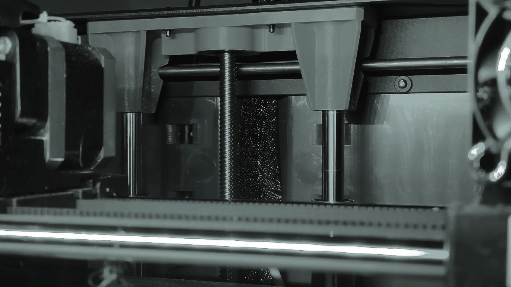
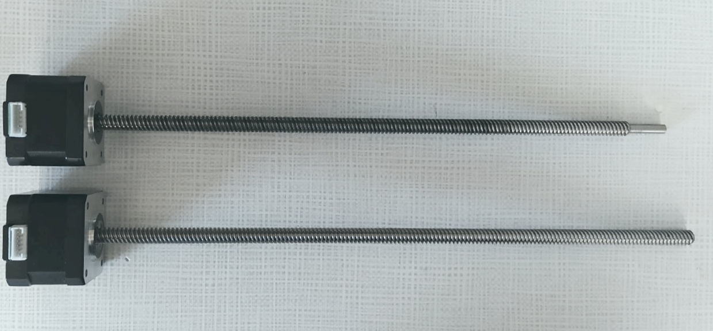
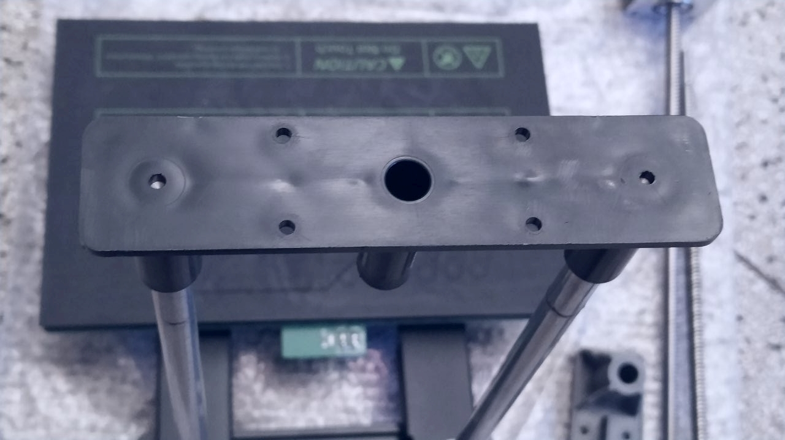
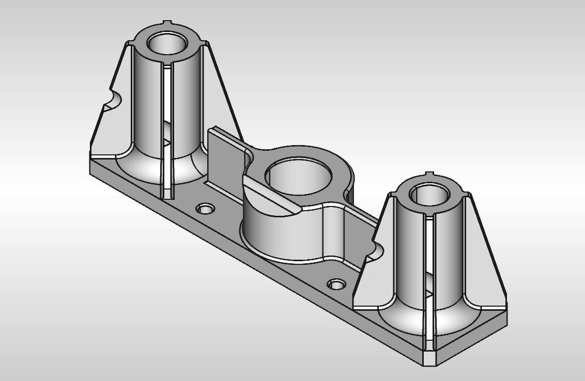

# z-axis lead screw replacement for Creator Pro 2 

Components:
- 1x Hanpose 17HS3401S-T8*8-300 stepper motor (NEMA17 size, 4-start Tr8x8 lead screw, 300 mm length (up to 310 mm)
- 1x 608Z bearing
- 1x **printed** end support block for 10 mm chrome steel rails, including
- 4x M3x4 heat-set inerts
- replacement for StepDrv v2.1 motor drivers or current adjustment (right after replacing, the current is too low)

## Lead Screw Replacement

Due to layer height inconsistencies and perceptible jamming every full turn, the lead screw of this FlashForge Creator Pro 2 was replaced. The total print time amounted to 266 hours at this point.

Unfortunately, the stock part (Bohong Stepping Motor 42HB34F04ASG-38) is reduced to a 5 mm (-30µm) section with 20 mm length to insert into a thin section bearing pressed into the original plastic end support, the fit of which was found to be loose. 

Top: old unit, bottom: replacement part.

## Old Support Block

After removing the bottom cover, unplugging the stepper motor and removal of the 8 screws holding top and bottom supports in the printer frame, the z axis assembly and print bed can be pulled out of the printer frame, starting by pulling the top support towards the inside of the printer.

When measuring, distances of the rails were found to be 99.92 mm at the bottom and 99.65 mm at the top. hinting at a possible cause for the screws of the linear bearings to have worked themselves loose.

The injection moulded parts are not visually impressive, but they primarily need to resist horizontal movement. Sink marks around the rod mounts are visible. The shafts were removed by holding in an ER32 collet block and a twisting motion.

## New Support Block

The design files are provided in this repository. For best results, clean up the holes with a 10mm F7 reamer, insert the original chrome steel shafts, zero calipers on the OD of one shaft, then measure the outsides of the pair of shafts as they're in place. To validate the model, the part was printed in PLA and came out measuring 99.96 mm. Keepin mind that to avoid deformation in warm operating conditions, a more temperature resistant filament type should be considered.

For the insertion of the 608 bearing, a tool should be used that presses down on the outer race.

